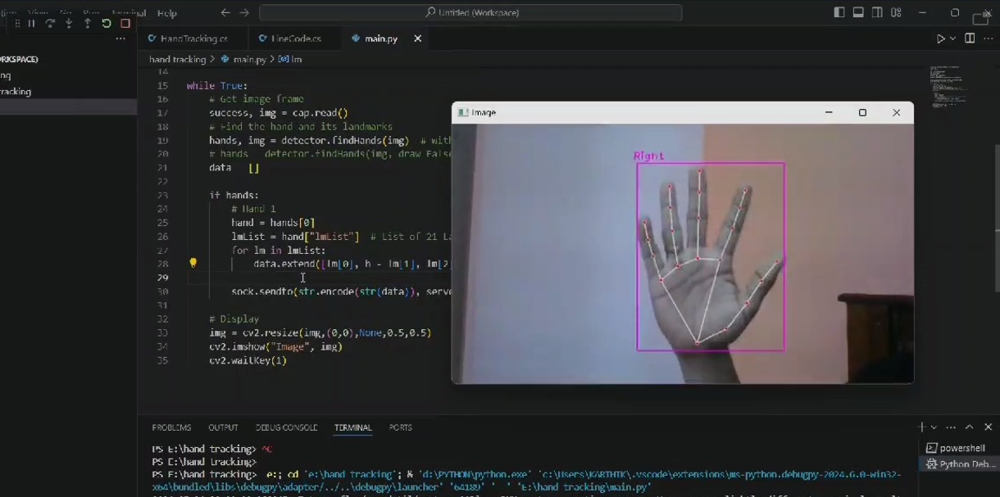
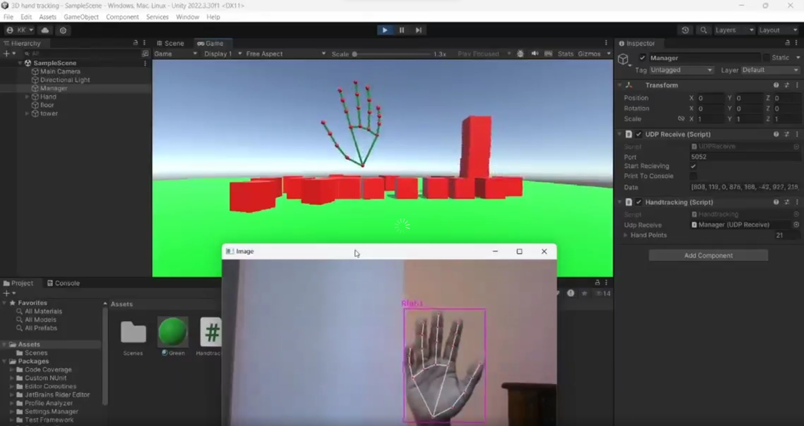
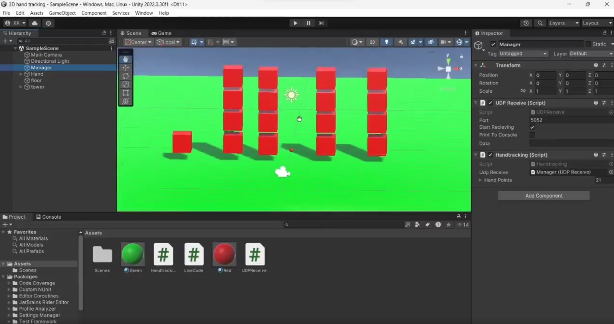

# 🌟 Hand Tracking and Visualization in Unity 3D using OpenCV 🌟

## Technologies Used

<div align="center">
<p align="center">  


  


</div>
<br><br>    

## Sample Images






## Table of Contents
- [Introduction](#introduction)
- [Features](#features)
- [Setup and Installation](#setup-and-installation)
- [Usage](#usage)
- [Project Structure](#project-structure)
- [3D Model File](#3d-model-file)
- [Contributing](#contributing)
- [License](#license)

## Introduction
Welcome to the Hand Tracking and Visualization in Unity 3D project! This project bridges the gap between real-world hand movements and virtual environments. By leveraging the power of OpenCV in Python, we track hand movements in real-time through a webcam feed and visualize these movements in a stunning Unity 3D environment. This provides a seamless and interactive experience for users.

## Features
- **🖐️ Real-time Hand Tracking**: Capture and track hand movements using OpenCV.
- **🎮 3D Visualization**: Mirror hand movements in a Unity 3D environment.
- **📦 Interactive Objects**: Interact with virtual cubes that can be lifted, tossed, or pushed.
- **🎨 Artistic Touch**: Draw lines between specific hand points to visualize hand trajectories.

## Setup and Installation

### Prerequisites
- 🐍 Python 3.x
- 🛠️ Unity 2020.3 or later
- 📷 OpenCV
- 🧩 CVZone
- 🌐 UDP communication package

### Python Environment Setup
1. **Clone the repository**:
    ```bash
    git clone https://github.com/yourusername/HandTrackingUnity3D.git
    cd HandTrackingUnity3D
    ```

2. **Install required Python packages**:
    ```bash
    pip install opencv-python cvzone
    ```

### Unity Environment Setup
1. **Open Unity**: Create a new Unity project or open an existing one.
2. **Add Scripts**: Copy `Handtracking.cs` and `LineCode.cs` into your Unity project's `Assets/Scripts` folder.
3. **Scene Setup**: Create a 3D scene with objects like cubes for interaction.
4. **UDP Configuration**: Ensure your Unity project is set up to receive UDP data from the Python script.

## Usage

### Running the Python Script
1. **Navigate to the project directory**:
    ```bash
    cd HandTrackingUnity3D
    ```

2. **Run the main script**:
    ```bash
    python main.py
    ```
    This script will start capturing frames from your webcam, detect hands, and send landmark points via UDP to the Unity application.

### Running the Unity Application
1. **Open your Unity project**.
2. **Play the Scene**: Press the Play button in the Unity Editor. Ensure that the Unity script is actively listening for UDP data.
3. **Interact with the Environment**: Move your hands in front of the webcam and see the movements mirrored in the Unity environment.

## Project Structure
```
HandTrackingUnity3D/
│
├── Python/
│   ├── main.py
│   └── requirements.txt
│
├── Unity/
│   ├── Assets/
│   │   ├── Scripts/
│   │   │   ├── Handtracking.cs
│   │   │   └── LineCode.cs
│   │   ├── Scenes/
│   │   └── ... (other Unity project files)
│
├── README.md
└── LICENSE
```

## 3D Model File
The 3D model files used in this project can be accessed via the following cloud drive link:
[Download 3D File](https://yourcloudlink.com/3dmodels)

## Contributing
We welcome contributions to enhance the functionality and features of this project. Please fork the repository, create a new branch, and submit a pull request with your changes.


Feel free to customize and enhance the script according to your project's needs. If you encounter any issues or have suggestions for improvement, please feel free to contribute or open an issue.

Happy coding!

# 🌐 Contact Through: 
<p align="left">
  <a href="https://www.facebook.com/ruban.swe.3" target="blank"></a>
  <a href="https://www.linkedin.com/in/karthik-pp-b80b38237/" target="blank"></a>
  <a href="https://www.instagram.com/ig_._karthik/" target="blank"></a>
  <a href="https://instagram.com/ig_._karthik" target="blank"></a>
  <a href="https://www.youtube.com/@KARTHIK4332" target="blank"></a>
</p>
